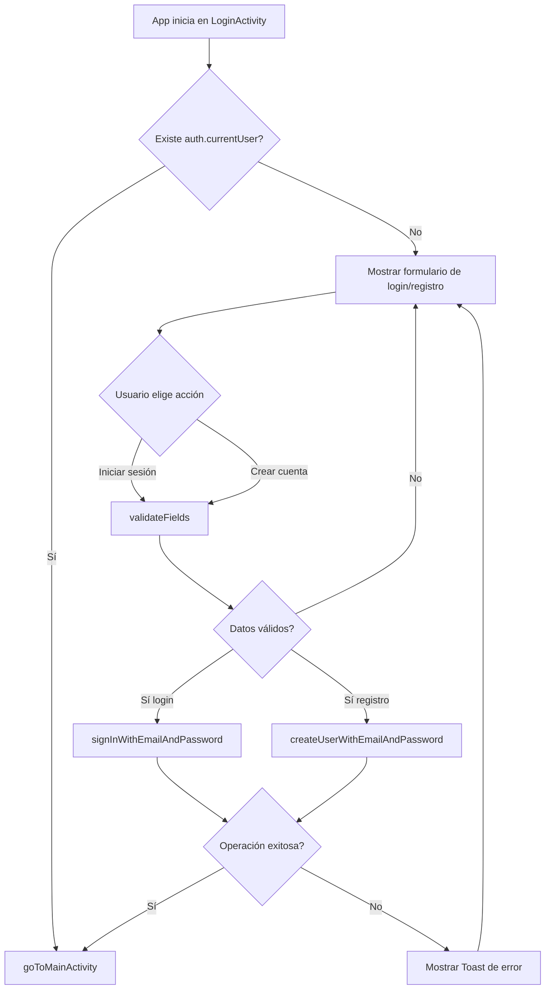
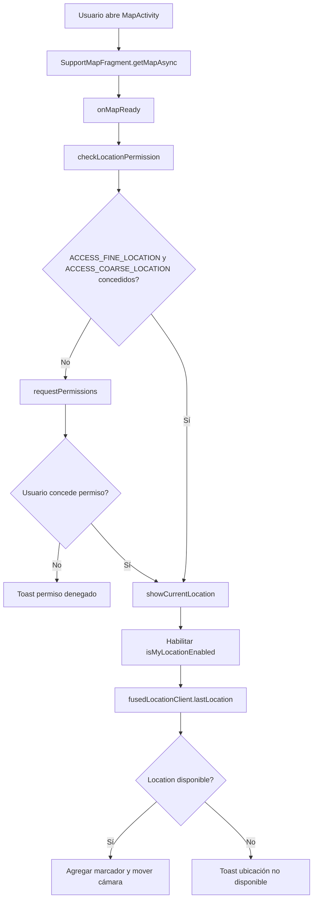

# Documentación del proyecto GestorTareas

Resumen práctico: `GestorTareas` es una aplicación Android nativa en Kotlin que permite autenticación con correo/contraseña, gestión básica de tareas persistidas por usuario en Firebase Realtime Database y visualización de la ubicación actual mediante Google Maps.

## Ruta rápida

1. Configurar `google-services.json` y `MAPS_API_KEY` en `local.properties`.
2. Ejecutar la app desde Android Studio o con `./gradlew installDebug` en un dispositivo/emulador con Android 12+.
3. Registrarse o iniciar sesión, crear tareas desde `FormActivity` y consultar ubicación desde `MapActivity`.

## Vista general

| Tema | Detalle |
|------|---------|
| Propósito | Centralizar tareas personales por usuario autenticado. |
| Tipo de app | Android nativa, arquitectura simple basada en `Activity` + repositorio. |
| Persistencia | Firebase Realtime Database bajo `tasks/{uid}`. |
| Autenticación | Firebase Authentication con correo y contraseña. |
| Ubicación | Google Maps + Fused Location Provider. |
| Estado en tiempo real | La lista principal se actualiza por `ValueEventListener`. |

## Alcance funcional actual

- Registro de usuarios con correo y contraseña.
- Inicio de sesión persistente entre aperturas.
- Listado de tareas del usuario autenticado.
- Creación, edición y eliminación de tareas.
- Vista de mapa con ubicación actual si el permiso fue concedido.
- Cierre de sesión y limpieza del flujo de navegación.

## Stack técnico y servicios externos

### Tecnologías principales

| Área | Implementación observada |
|------|---------------------------|
| Lenguaje | Kotlin |
| UI | Android Views con XML (`activity_login.xml`, `activity_main.xml`, `activity_form.xml`, `activity_map.xml`) |
| SDK mínimo | `minSdk = 31` |
| SDK objetivo | `targetSdk = 36` |
| Build system | Gradle Kotlin DSL |
| Java target | Java 11 |

### Dependencias y servicios

| Componente | Uso en el proyecto |
|------------|--------------------|
| `Firebase Authentication` | Registro, login y control de sesión en `LoginActivity`. |
| `Firebase Realtime Database` | CRUD de tareas en `FirebaseTaskRepository`. |
| `Google Maps SDK for Android` | Renderizado del mapa en `MapActivity`. |
| `FusedLocationProviderClient` | Obtención de la última ubicación conocida. |
| `Material Components` | Componentes visuales base. |

### Configuración sensible

- `app/google-services.json` existe y es requerido para Firebase, pero su contenido no debe exponerse en documentación pública.
- La clave de Google Maps se inyecta vía `MAPS_API_KEY` desde `local.properties` hacia `AndroidManifest.xml`.

## Estructura relevante del proyecto

```text
GestorTareas/
├── app/
│   ├── build.gradle.kts
│   ├── google-services.json
│   └── src/main/
│       ├── AndroidManifest.xml
│       ├── java/com/example/gestortareas/
│       │   ├── LoginActivity.kt
│       │   ├── MainActivity.kt
│       │   ├── FormActivity.kt
│       │   ├── MapActivity.kt
│       │   ├── FirebaseTaskRepository.kt
│       │   └── Task.kt
│       └── res/
│           ├── layout/
│           │   ├── activity_login.xml
│           │   ├── activity_main.xml
│           │   ├── activity_form.xml
│           │   └── activity_map.xml
│           └── values/
│               └── strings.xml
├── build.gradle.kts
├── settings.gradle.kts
├── gradle/libs.versions.toml
└── local.properties
```

## Responsabilidades por archivo principal

| Archivo | Responsabilidad |
|--------|------------------|
| `LoginActivity.kt` | Gestiona validaciones básicas, login, registro y redirección al área autenticada. |
| `MainActivity.kt` | Orquesta la pantalla principal, escucha tareas en tiempo real, abre formulario, mapa y logout. |
| `FormActivity.kt` | Reutiliza un único formulario para crear o editar tareas. |
| `MapActivity.kt` | Gestiona permisos, carga Google Maps y centra el mapa en la ubicación actual. |
| `FirebaseTaskRepository.kt` | Encapsula acceso a Firebase Realtime Database y separación por `uid`. |
| `Task.kt` | Modelo de datos serializable/deserializable por Firebase. |
| `AndroidManifest.xml` | Declara permisos de ubicación, actividades y metadata de Maps. |

## Modelo de datos y repositorio

### Modelo `Task`

| Campo | Tipo | Uso |
|------|------|-----|
| `id` | `String` | Identificador del nodo en Firebase. |
| `name` | `String` | Nombre visible de la tarea. |
| `description` | `String` | Descripción libre de la tarea. |

### Estructura de persistencia

```text
tasks/
└── {uid}/
    ├── {taskId}/
    │   ├── id
    │   ├── name
    │   └── description
    └── ...
```

### Responsabilidades de `FirebaseTaskRepository`

- Obtener el `uid` del usuario autenticado actual.
- Crear tareas con `push()` y persistir el `taskId` generado.
- Actualizar tareas existentes por `task.id`.
- Eliminar tareas por `taskId`.
- Escuchar el nodo `tasks/{uid}` con `ValueEventListener`.
- Transformar `DataSnapshot` en `List<Task>` para la UI.

## Flujos principales

### 1) Flujo de inicio / autenticación



### 2) Flujo de lista de tareas y sincronización

```mermaid
flowchart TD
    A[MainActivity.onCreate] --> B{Usuario autenticado?}
    B -- No --> C[goToLogin]
    B -- Sí --> D[Inicializar FirebaseTaskRepository]
    D --> E[listenTasks]
    E --> F[Firebase escucha tasks/{uid}]
    F --> G[onDataChange snapshot]
    G --> H[Convertir snapshot en List<Task>]
    H --> I{Lista vacía?}
    I -- Sí --> J[Mostrar tvEmptyState]
    I -- No --> K[Construir ArrayAdapter y poblar ListView]
    K --> L[Usuario toca una tarea]
    L --> M[Dialogo editar/eliminar]
    M -- Eliminar --> N[deleteTask]
    N --> F
    M -- Editar --> O[Abrir FormActivity con extras]
```

### 3) Flujo de creación y edición de tareas

```mermaid
flowchart TD
    A[Usuario abre FormActivity] --> B{Llegó task_id?}
    B -- Sí --> C[Modo edición y precarga de datos]
    B -- No --> D[Modo creación]
    C --> E[Usuario pulsa Guardar]
    D --> E
    E --> F[Validar name y description]
    F --> G{Datos válidos?}
    G -- No --> H[Mostrar error en EditText]
    G -- Sí --> I{isEditMode?}
    I -- Sí --> J[updateTask con task.id existente]
    I -- No --> K[saveTask con push()]
    J --> L{Éxito?}
    K --> L
    L -- Sí --> M[Toast y finish]
    L -- No --> N[Rehabilitar botón y mostrar Toast]
```

### 4) Flujo de mapa y ubicación



## Navegación entre pantallas

| Origen | Destino | Condición |
|--------|---------|-----------|
| `LoginActivity` | `MainActivity` | Login o registro exitoso, o sesión ya existente. |
| `MainActivity` | `FormActivity` | Usuario pulsa `btnAddTask` o selecciona editar una tarea. |
| `MainActivity` | `MapActivity` | Usuario pulsa `btnOpenMap`. |
| `MainActivity` | `LoginActivity` | Usuario cierra sesión o no existe sesión válida al abrir. |
| `FormActivity` | `MainActivity` | `finish()` tras guardar/actualizar o al volver. |
| `MapActivity` | `MainActivity` | `finish()` al volver. |

## Notas de compilación y ejecución

### Requisitos

- Android Studio con soporte para AGP 9.2.x.
- JDK 11.
- Dispositivo o emulador con Android 12 (API 31) o superior.
- Proyecto de Firebase configurado para Authentication y Realtime Database.
- API key válida para Google Maps configurada localmente.

### Configuración esperada

1. Colocar `google-services.json` dentro de `app/`.
2. Definir `MAPS_API_KEY` en `local.properties`.
3. Verificar que el proyecto Firebase tenga habilitados:
   - Authentication con proveedor correo/contraseña.
   - Realtime Database accesible para el entorno de desarrollo.
4. Sincronizar Gradle desde Android Studio.

### Ejecución

| Opción | Acción |
|--------|--------|
| Android Studio | Abrir el proyecto y ejecutar la configuración `app`. |
| Gradle | Usar `./gradlew installDebug` y luego abrir la app en el dispositivo. |

## Limitaciones y oportunidades de mejora basadas en el código

| Observación | Evidencia en código | Impacto |
|------------|---------------------|---------|
| Arquitectura acoplada a `Activity` | La lógica de UI y coordinación vive directamente en `LoginActivity`, `MainActivity`, `FormActivity` y `MapActivity`. | Complica pruebas, escalado y reutilización. |
| Sin `ViewModel`, `StateFlow` ni capa de dominio | No aparecen capas intermedias ni gestión formal de estado. | Mayor acoplamiento entre UI y datos. |
| URL de Firebase Realtime Database hardcodeada | `FirebaseTaskRepository` usa `FirebaseDatabase.getInstance("...")`. | Hace más difícil cambiar entorno o parametrizar ambientes. |
| Validación de autenticación básica | `validateFields` revisa campos vacíos, formato de correo con `Patterns.EMAIL_ADDRESS` y longitud mínima de contraseña. | Sigue concentrada en la `Activity`; convendría extraerla si crecen las reglas. |
| Ubicación basada en `lastLocation` | `MapActivity` no solicita actualizaciones activas, solo última ubicación conocida. | Puede mostrar datos nulos o desactualizados. |
| Presentación de lista simple | `MainActivity` usa `ListView` + `ArrayAdapter` con texto concatenado. | Limita personalización, accesibilidad avanzada y escalabilidad visual. |

## Checklist de lectura rápida

- [x] La app depende de Firebase Authentication y Firebase Realtime Database.
- [x] Las tareas se guardan separadas por usuario en `tasks/{uid}`.
- [x] `FormActivity` cubre creación y edición con el mismo formulario.
- [x] `MainActivity` refleja cambios de Firebase en tiempo real mediante listener.
- [x] `MapActivity` requiere permiso de ubicación y una clave de Google Maps configurada localmente.

## Próximo paso recomendado

Si este proyecto va a crecer, el siguiente paso razonable es separar presentación, estado y datos con `ViewModel` + repositorios inyectados, y extraer configuración sensible para soportar múltiples entornos de ejecución.
